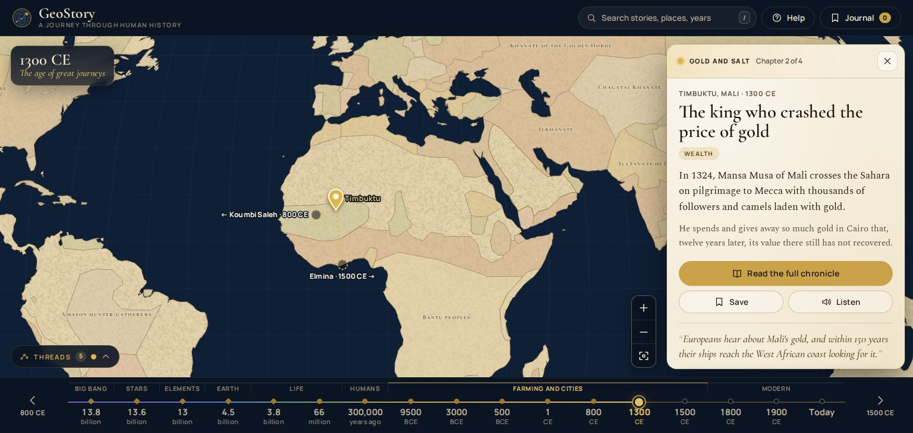
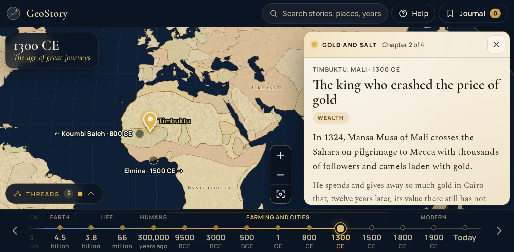

# GeoStory

**A spatiotemporal journey through human history.**

GeoStory is an interactive map of history that you can move through time. Drag the timeline from the Big Bang to today, and the map shows the world of that moment. Every pin opens a short, sourced story, and the stories are linked into five **threads** that you can follow across thousands of years.

Course project for *HCI & Visualization*, IIT Ropar.



## Contents

- [Problem statement](#problem-statement)
- [Objectives](#objectives)
- [Team](#team)
- [Technologies used](#technologies-used)
- [Features](#features)
- [Run it on your computer](#run-it-on-your-computer)
- [What we improved after user testing](#what-we-improved-after-user-testing)
- [How the code is organised](#how-the-code-is-organised)
- [Testing](#testing)
- [Credits and licences](#credits-and-licences)

## Problem statement

People who are curious about history, but are not experts, have no simple way to see **what was happening, where, and when**, as a story.

Existing tools each show only part of the picture:

| Tool | What it does well | What is missing |
|---|---|---|
| Histography | Every event on one timeline | Time only: there is no map, and each event is a bare fact |
| ORBIS | A detailed map of Roman travel | Space only: one fixed period, no movement through time |
| Chronas | A map with a time slider | Data over narrative: clicking a region opens a raw Wikipedia article |

So a learner has to choose between a timeline without places, a map without time, or a time-map that reads like an encyclopedia. None of them connects one event to the next.

## Objectives

1. **Time and space together.** Let a user move through time and see the world change on one map.
2. **Stories, not articles.** Tell history as short stories written from cited sources, in plain language.
3. **Connected, not random.** Link stories into threads, so history reads as a journey and not as isolated facts.
4. **Easy for a first-time user.** One screen, immediate feedback for every action, and little to remember.
5. **Accessible.** Usable with the keyboard alone, labelled for screen readers, and readable at 200% browser zoom.
6. **Worth coming back to.** Let users save stories, and ask follow-up questions that are answered only from the story's own text.

The two key user tasks are:

- **T1 – Navigate time to discover activity:** go to a period and find what was happening in a region.
- **T2 – Explore a chronicle:** open a story and read its full narrative.

## Team

| Name | Entry number |
|---|---|
| Nikhil Varma | 2024AIB1350 |
| Dhruva Kumar | 2024EEB1196 |

## Technologies used

| Area | Technology | Why |
|---|---|---|
| Structure and style | HTML5, CSS3 (grid, custom properties, media queries) | No framework needed for a one-screen app |
| Behaviour | JavaScript (ES modules), no framework and no build step | Small, readable modules; runs as it is written |
| Map | [D3.js](https://d3js.org) v7 (`geoNaturalEarth1` projection, zoom) and [TopoJSON](https://github.com/topojson/topojson-client) | Draws real historical borders as SVG, so pins and borders always move together |
| Server | [Node.js](https://nodejs.org) built-in `http` module, **zero npm dependencies** | Serves the site and keeps the AI key private |
| AI | Google Gemini API, called only from the server | "Ask the Chronicler" answers from the story's own text |
| Read aloud | Web Speech API (built into the browser) | Free, no key |
| Saved stories | `localStorage` | No account or database needed |
| Map data | Natural Earth, historical-basemaps | Land shapes and borders for each era |
| Testing | Playwright (development only) | Automated checks at 8 screen sizes |
| Version control | Git and GitHub | |

## Features

| Feature | How to use it |
|---|---|
| **Timeline** from the Big Bang to today, 17 stops in the 8 "thresholds" of Big History | Drag the gold marker, click any year, use ← →, or the arrows at each end |
| **Historical world map** with the borders of each era | Appears from 66 million years ago onwards; earlier stops are animated sky scenes |
| **Pins**, one per story, in the colour of their thread | Click a pin |
| **Story card** with place, date, picture, story and sources | Slides in from the right |
| **Threads**: five storylines that connect stories across eras | *Continue the thread* on a story card, or open **Threads** (bottom left) and pick any chapter |
| **Full chronicle** (Mansa Musa, 1324): six chapters, a route map that follows your reading, "Myth or fact?" | *Read the full chronicle* |
| **Search** for a story, place, person or year | The box at the top, or press `/` |
| **Journal**: saved stories, grouped by thread, with Undo when you remove one | *Save* on a story, then **Journal** at the top |
| **Ask the Chronicler** (Gemini): answers only from the story's text | In every story card |
| **Listen**: reads the story aloud | In every story card |
| **Help**: what GeoStory is and how the screen works | The first screen, and **Help** at the top |
| Shareable links | The address bar always points to the current year and story |

Stories without a full chronicle say "Full chronicle (in construction)" on purpose, instead of a button that does nothing.

### The five threads

| Thread | Chapters |
|---|---|
| The human story | Chicxulub (66 million years ago) → Jebel Irhoud (300,000 years ago) → Göbekli Tepe (9500 BCE) → Uruk (3000 BCE) |
| Ideas that travel | Giza (3000 BCE) → Athens (500 BCE) → Baghdad (800 CE) → Mainz (1500 CE) → CERN (today) |
| The Silk Roads | Persepolis (500 BCE) → Chang'an (1 CE) → Rome (1 CE) → Samarkand (800 CE) → Khanbaliq (1300 CE) → Calicut (1500 CE) |
| Gold and salt | Koumbi Saleh (800 CE) → **Mansa Musa, Timbuktu (1300 CE)** → Elmina (1500 CE) → Johannesburg (1900 CE) |
| Engines of change | Manchester (1800 CE) → Detroit (1900 CE) → Shenzhen (today) |

The threads follow widely used world histories: Frankopan, *The Silk Roads* (2015); Gomez, *African Dominion* (2018); Christian, *Maps of Time* (2004). Each story lists its own sources.

## Run it on your computer

You need [Node.js](https://nodejs.org) 18 or newer (the "LTS" download). Nothing else has to be installed.

```
git clone https://github.com/nikhil280607-oss/geostory.git
cd geostory
npm start
```

Then open **http://localhost:5173** in your browser. Press `Ctrl + C` in the terminal to stop.

> Double-clicking `index.html` will not work, because browsers block JavaScript modules opened that way. Always use `npm start`.

### Turn on "Ask the Chronicler" (optional)

1. Create a free key at https://aistudio.google.com/app/apikey.
2. Make a copy of `.env.example` and name the copy `.env`.
3. In `.env`, paste the key after `GEMINI_API_KEY=`.
4. Restart with `npm start`. The terminal should say `Ask the Chronicler: ON`.

`.env` is listed in `.gitignore`, so the key is never uploaded to GitHub. The key is read only by the server; the browser never sees it. Without a key, everything else still works.

### Put it online (optional)

Import the repository into [Vercel](https://vercel.com), then add `GEMINI_API_KEY` under *Settings → Environment Variables* and redeploy. No build settings are needed.

## What we improved after user testing

We tested the first build with five users, a heuristic evaluation and an accessibility check. All five users finished both tasks (SUS 79), but most did not understand what GeoStory offers, especially the threads. The table lists every issue from the [test report](docs/Lab7_Usability_Test_Report.pdf) and what changed. Severity is on Nielsen's 0–4 scale.

| # | Issue found in testing | Sev. | What we changed | Main files |
|---|---|---|---|---|
| U2 | No "what is this / how to use it" at the start; users did not know a year can be clicked | 3 | A new **Help page** is the first screen: what GeoStory is, a screenshot with numbered arrows, the threads, shortcuts, and one **Enter** button. It reopens from **Help** at the top. A one-time hint points at the timeline. | `help.js`, `timeline.js` |
| U1 | Users did not understand the five threads | 3 | The **Threads panel** shows the number of chapters in each thread. Hover or click a thread to list its chapters with dates, and click one to go there. The chapter you are reading is marked "You are here". | `threadsPanel.js` |
| H8 | With a story open, panels crowded the map and the linked chapter went off-screen | 3 | The era card shrinks to a small chip and Threads folds to a button. The map now frames the story's pin **and** its previous and next chapter together. | `map.js`, `app.css` |
| A1 | At 200% zoom the Threads panel disappeared and the map shrank | 3 | Nothing is hidden any more: panels become a chip and a button, the timeline scrolls sideways instead of squeezing its labels, and the map moves closer instead of shrinking. | `app.css`, `map.js`, `timeline.js` |
| U3 | Timeline years too small | 2 | Years are larger (14.5px, was 10.5px) and written on two lines. | `timeline.js`, `app.css` |
| H2 | "66 m", "300 k", "13.8 bn" were unclear | 2 | Labels now read "66 million", "300,000 years ago", "13.8 billion". Hovering a stop shows the full date and title. | `waypoints.js`, `timeline.js` |
| H1 | Pins were small and easy to miss | 2 | Pins are 30% larger, pulse, and have the place name under them. | `map.js`, `app.css` |
| H6 | The globe icon was unclear; zoom buttons were not noticed | 2 | Larger map buttons with a new "reset" icon. Each shows its name ("Zoom in", "Zoom out", "Reset view") on hover and keyboard focus. | `main.js`, `app.css` |
| H3 | A removed story could not be brought back | 2 | "Removed … **Undo**" appears for 7 seconds. | `journal.js` |
| H4 | The same × closed the panel and removed a story | 2 | Removing now uses a bin icon; × only closes. | `journal.js` |
| H5 | Removing happened instantly with no check | 2 | Solved by Undo. We chose undo over an "Are you sure?" box because removing a bookmark is a small action. | `journal.js` |
| H7 | No search | 2 | A **search box** finds stories, places, people and years, and jumps straight there. | `search.js` |

Smaller changes made along the way:

- Hovering a linked chapter on the map says which chapter it is (asked for in the feedback form).
- Pins can no longer hide under the left-hand panels in a window that is not maximised.
- Three labels in the Journal and the full chronicle had low contrast (3.4:1). Lighthouse missed them because those panels were closed during the audit. They now meet 4.5:1.

| Before: 200% zoom | After: 200% zoom |
|---|---|
| Threads panel gone, era card over the map, labels overlapping |  |

More screenshots: [the map](docs/screenshots/map-1300.jpg), [a thread's chapters](docs/screenshots/threads.jpg), [the Help page](docs/screenshots/help.jpg).

**Still to do (content, later labs):** more stories and pictures, Indian history, narration in more languages, and checking the borders of each period.

## How the code is organised

Every action follows one path: **user action → `store.set()` → `render()`**. Modules do not call each other, which keeps them independent and easy to test.

```
server.js               local web server and the /api endpoints (no dependencies)
lib/chronicler.js       Ask the Chronicler: builds the story context, calls Gemini (server only)
api/                    the same endpoints for Vercel
public/
  index.html
  css/                  base (colours, fonts) · app (layout, map, timeline) · story · reader · panels
  js/
    main.js             starts the app and connects the modules
    store.js            the single app state { eraIndex, storyId, readerOpen, journalOpen }
    content.js          lookups over the data files
    map.js              world map, borders, pins, thread links, camera
    geoData.js          loads and caches map files
    geoClean.js         repairs border shapes before drawing
    cosmos.js           deep-time sky scenes
    timeline.js         the time slider
    eraCard.js          era title panel
    threadsPanel.js     the Threads panel and chapter lists      (new in v3.1)
    search.js           search box                               (new in v3.1)
    help.js             Help page and welcome screen             (new in v3.1)
    storyCard.js        story card
    reader.js           full chronicle view
    journal.js          saved stories, remove and undo
    askBox.js           Ask the Chronicler (browser side)
    narrator.js         read aloud
    util.js             small helpers, icons, layout rules
  data/
    waypoints.js        the 17 timeline stops
    threads.js          the 5 threads
    stories.js          22 stories with coordinates and sources
    chronicles/         full chronicles (Mansa Musa)
    geo/                simplified map files
scripts/
  check-content.mjs     content test
  test-layout.mjs       screen test
  make-help-shot.mjs    retakes the Help page screenshot
  build-geo.mjs         one-time map data preparation
docs/                   test report and screenshots
```

To add a story, add an object to `public/data/stories.js` with a `waypoint`, `thread`, `order`, `lat`, `lon` and `sources`, then run `npm run check`.

## Testing

```
npm run check
```

Checks that every pin is on land (using the same land shapes the map draws), every border map draws correctly, threads are numbered without gaps, and every story has sources.

```
npm run test:layout
```

Opens the site in a headless browser at 8 sizes (common laptops, Windows scaling of 125% and 150%, a window that is not maximised, browser zoom of 200% and 250%, and a phone). At each size it performs both key tasks and checks each improvement: the Help page and its Enter button, readable timeline labels with no overlaps, the Threads panel never hidden, linked chapters on screen when a story is open, the chapter list, search, journal undo, named map buttons, no page scrolling and no JavaScript errors. It needs Playwright: `npm i -D playwright && npx playwright install chromium`.

Tested by people too: see the [test report](docs/Lab7_Usability_Test_Report.pdf).

## Credits and licences

- Map land: [Natural Earth](https://www.naturalearthdata.com) (public domain).
- Historical borders: [historical-basemaps](https://github.com/aourednik/historical-basemaps) by André Ourednik and contributors, licensed GPL-3.0. The files in `public/data/geo/` are simplified copies and stay under that licence (see `public/data/geo/LICENSE-historical-basemaps.txt`). Borders are approximate.
- Map drawing: D3 (ISC) and topojson-client (ISC), included in `public/vendor`.
- Fonts: Cormorant Garamond, Spectral and Manrope (SIL Open Font Licence), in `public/fonts`.
- Pictures: Wikimedia Commons, credited under each picture.
- Timeline structure: David Christian, *Maps of Time* (2004), and the Big History Project.
